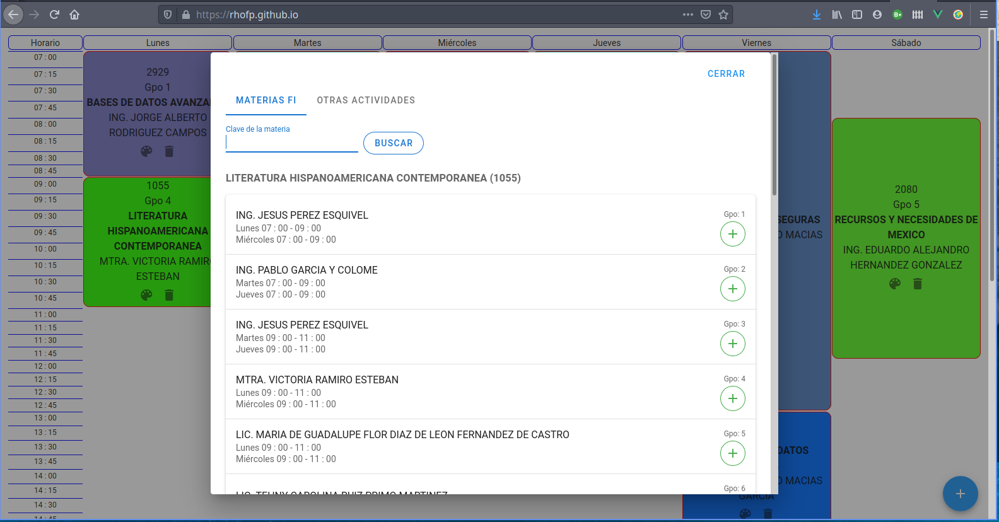
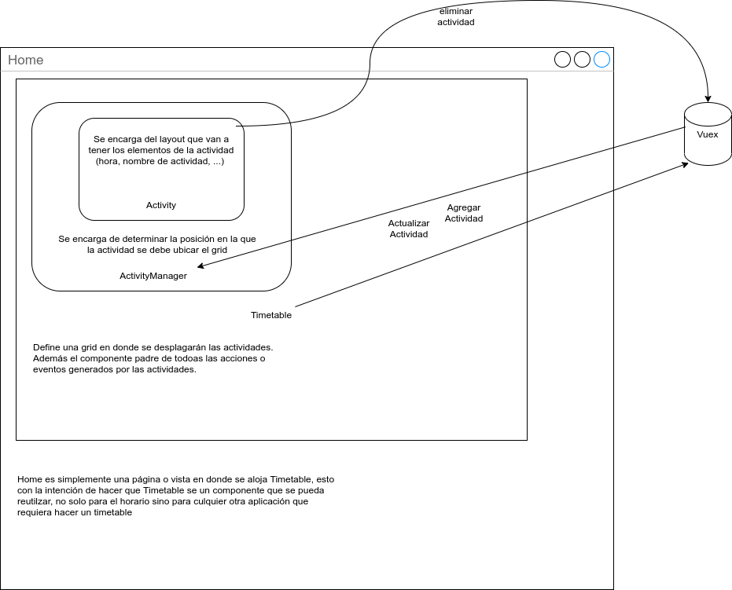

= Amiko scheduler

Aplicación para planificar tu horario escolar (y de otras actividades) para la
FI.

```sh
Septiembre 2020
Vue 2.6.11 | puppeteer 5.2
```

image:./assets/proof.jpg[]




== Componentes del proyecto 

En el siguiente bosquejo observamos como interactuan los 3
componentes principales para poder renderizar un "timetable".




//- Add extra activities: gym, language, ... [PROCESS]
//- Fix cell layout: show start and end time
//- Change group button
//- Print (Download) button
//- Take homework notes
//- Scale to a todo list with calendar and more features
//- Save zoom Links
//- Add sidebar / header
//- Share schedules
//- Login
//- Fork function
//- Store schedule in db
//- Fork friends schedule
